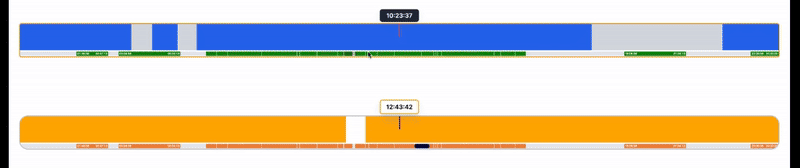
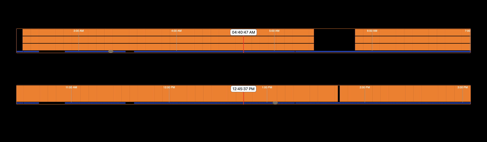
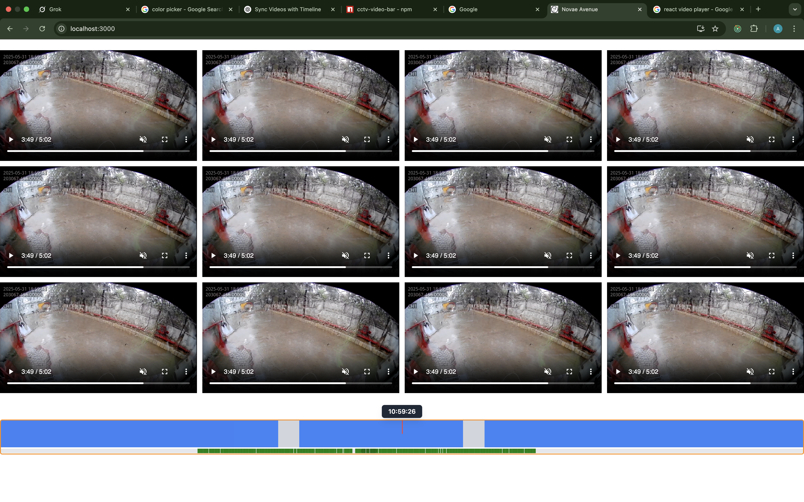

# cctv-video-bar

*A customizable React timeline component to visualize 24-hour CCTV video availability. Easily highlight recorded video segments and navigate to specific times using a scrollable interface.*


---






## Installation

```bash
npm install cctv-video-bar
```

## Usage

```tsx
import { CCTVVideoBar, VideoSegment } from "cctv-video-bar";

const App = () => {
  const segments: VideoSegment[] = [
    { startTime: "12:00am", endTime: "12:01am" },
    { startTime: "12:03am", endTime: "12:07am" },
    { startTime: "12:08am", endTime: "12:09am" },
    { startTime: "01:20am", endTime: "01:30am" },
    { startTime: "03:30am", endTime: "04:45am" },
    { startTime: "06:00am", endTime: "07:20am" },
    { startTime: "09:10am", endTime: "10:00am" },
    { startTime: "12:25pm", endTime: "01:15pm" },
    { start_time: "01:46:58", end_time: "02:47:13" }, 
    { start_time: "03:06:58", end_time: "05:04:13" },// <================Currently, we accept three different time formats.
    { start_time: new Date(), end_time: new Date() },// <================Currently, we accept three different time formats.
    { start_time: "2025-05-31 08:38:51", end_time: "2025-05-31 08:43:52" },// <=========Currently, we accept three different time formats.
  ];

  return (
    <CCTVVideoBar
      totalSeconds={86400}
      segmentWidth={1}
      segmentHeight={60}
      videoSegments={videoSegments}
      onTimeChange={handleTimeChange}
      value={controlledValue}
      containerStyle={{}}
      midLineStyle={{}}
      timeTextStyle={{}}
      barStyle={{}}
      emptyBarColor="#d1d5db"
      scrollContainerStyle={{}}
      scrollbarStyle={{}}
      scrollbarSegmentStyle={{}}
      viewportIndicatorStyle={{}}
/>
  );
};

export default App;
```


## Props


| Prop                     | Type                     |Description                                                                                           |
| ------------------------ | ------------------------ | ----------------------------------------------------------------------------------------------------- |
| `totalSeconds`           | `number`                 | Total duration of the timeline in seconds (e.g., 86400 for 24 hours).                                 |
| `segmentWidth`           | `number`                 | Width of each video segment in pixels.                                                                |
| `segmentHeight`          | `number`                 | Height of the video timeline bar in pixels.                                                           |
| `videoSegments`          | `VideoSegment[]`         | Array of recorded video segments, each with `startTime` and `endTime` properties (timestamps).        |
| `onTimeChange`           | `(time: string) => void` | Callback fired when the user navigates to a different time on the timeline.                           |
| `value`                  | `string`                 | Controlled value representing the currently selected time as a formatted string (e.g., "HH\:mm\:ss"). |
| `containerStyle`         | `React.CSSProperties`    | Custom CSS styles for the outer container of the timeline.                                            |
| `midLineStyle`           | `React.CSSProperties`    | CSS styles for the vertical midline indicator displayed on the timeline.                              |
| `timeTextStyle`          | `React.CSSProperties`    | CSS styles for the time label text displayed along the timeline.                                      |
| `barStyle`               | `React.CSSProperties`    | CSS styles for the bar representing recorded video segments.                                          |
| `emptyBarColor`          | `string`                 | Color string (e.g., hex code) used for the empty/unrecorded portions of the timeline bar.             |
| `scrollContainerStyle`   | `React.CSSProperties`    | CSS styles for the scrollable container that wraps the timeline bar.                                  |
| `scrollbarStyle`         | `React.CSSProperties`    | CSS styles for the scrollbar element itself.                                                          |
| `scrollbarSegmentStyle`  | `React.CSSProperties`    | CSS styles for individual segments within the scrollbar.                                              |
| `viewportIndicatorStyle` | `React.CSSProperties`    | CSS styles for the viewport indicator that shows the visible timeline window.                         |


## License

This project is licensed under the [MIT License](https://github.com/MauryaAK/cctv-video-bar/blob/main/LICENSE).
